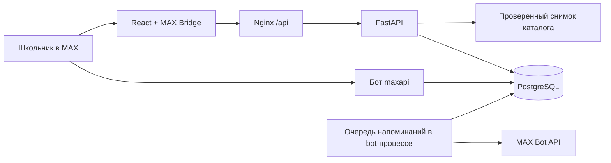

# Олимпиадный маршрут

Бот и мини-приложение MAX: школьник выбирает программы вуза, собирает олимпиадный трек, проверяет условия льгот и получает напоминания с действиями. Продуктовый кейс — [.agents/CASE.md](.agents/CASE.md).

## Что работает

- Адаптивный интерфейс: каталог, поиск и фильтры, карточки источников, профиль и выбор целей, личный маршрут и календарь. Напоминания и управление доставкой находятся в чате MAX.
- Четыре программы ВШЭ и ИТМО и девять олимпиадных профилей. Проверенные связи с правилами приёма 2026 года отделены от неизвестных условий и будущих кампаний.
- Хранение профилей, треков, отметок, сессий и очереди сообщений в PostgreSQL. SQLite поддерживается для локального запуска и тестов.
- Вход через MAX: серверная проверка HMAC `initData`, срока действия и идентификатора; далее используется случайный отзываемый токен сессии. На сервере хранится его хеш.
- Бот: настройка класса и целей, поиск, карточки условий, личный маршрут, ближайшие сроки, отметки регистрации, тихие часы и кнопки уведомлений. Изменения видны в приложении после возврата или следующего опроса API (15 секунд).
- Напоминания за семь дней и за сутки до известного срока, тихие часы, отмена устаревших напоминаний, перенос на час и защита от обычной повторной отправки одной задачи.
- Отдельные тестовые события регистрации и изменения правила. В чате карточка олимпиады содержит кнопку «Тест сообщения в чат»; событие явно помечено как пример. Веб-интерфейс не содержит тестовых кнопок и ленты уведомлений.
- Удаление профиля вместе с треком, историей и сессиями.

## Быстрый запуск в Docker

Нужны Docker Engine / Docker Desktop и Docker Compose v2.

```bash
cp .env.example .env
docker compose up --build -d --wait
```

Откройте **http://localhost:8080**. PostgreSQL и API не публикуют порты наружу; Nginx обслуживает интерфейс и проксирует `/api`. Миграции выполняются перед стартом API. По умолчанию доступно браузерное демо, токен MAX для него не нужен.

Если порт занят:

```bash
FRONTEND_PORT=18088 docker compose up --build -d --wait
```

Проверка и остановка:

```bash
curl http://localhost:8080/api/v1/healthz/ready
docker compose logs --tail=100 api
docker compose down
```

`down` сохраняет базу в Docker volume. После повторного запуска профиль и отметки остаются. `down -v` удаляет базу; используйте только для намеренного сброса тестового стенда.

Первоначальная загрузка базовых образов и пакетов зависит от сети. В Dockerfile используются закреплённые digest образов, `uv.lock` и `pnpm-lock.yaml`.

## Подключение к MAX

1. Заполните `APP_BOT_TOKEN` и `APP_BOT_USERNAME` в корневом `.env`. Имя — ник выданного бота без `@`. Ник можно получить через официальный `GET /me`; рабочий токен не передавайте frontend и не коммитьте.
2. Разместите frontend по публичному HTTPS-адресу. TLS завершает внешний reverse proxy; локальный Nginx слушает HTTP. Один origin должен обслуживать и приложение, и `/api`.
3. Передайте HTTPS-ссылку организаторам для привязки мини-приложения к выданному боту, как описано в [FAQ](.agents/sources/Общий%20FAQ.pdf). Привязка на стороне MAX проверяется открытием приложения из бота.
4. Запустите бота и API с одним токеном и одной базой:

```bash
docker compose --profile max up --build -d --wait
```

5. Откройте бота в MAX, нажмите «Начать», настройте `/profile` и включите сообщения через `/settings`. Эти шаги доступны целиком в чате.

Бот использует long polling, поэтому публичный webhook не обязателен. Webhook-режим сохранён: нужны `APP_BOT_MODE=webhook`, HTTPS URL и secret; при его использовании отдельно настройте прокси к порту бота и соответствующие переменные Compose. Не запускайте одновременно несколько polling-процессов с одним токеном.

MAX Bridge подключён из официального CDN. Ссылки на источники открываются через Bridge, когда приложение запущено в MAX. Подпись проверяется по [официальному протоколу MAX](https://dev.max.ru/docs/webapps/validation); браузерные `initDataUnsafe` не используются как основание авторизации.

## Работа в чате MAX

| Команда | Что делает |
| --- | --- |
| `/start`, `/help` | Меню с кнопками основных действий |
| `/profile` | Выбор класса и до двух целей, подтверждение согласия |
| `/catalog` или обычный текст «Физтех» | Поиск и карточки олимпиад |
| `/track` | Личный маршрут и кнопки управления каждой олимпиадой |
| `/deadlines` | Ближайшие проверенные сроки в часовом поясе ученика |
| `/settings` | Состояние сообщений, тихие часы и кнопка включения |
| `/resume`, `/stop` | Включить или отключить напоминания |
| `/quiet 22 8` | Установить тихие часы; `0 0` отключает их |
| `/timezone Asia/Yekaterinburg` | Сменить часовой пояс |

В карточке есть условия льгот по выбранным целям, ссылки организатора, добавление в маршрут, «Я зарегистрировался», «Завершил участие» и удаление с подтверждением. Отметка регистрации — самоотчёт, бот не регистрирует ученика на сайте организатора. Профиль обрабатывается только в личном чате, действия выполняются для нажавшего кнопку пользователя.

Год поступления рассчитывается из класса по окончанию 11 класса: в учебном году 2026/27 это 2027 для 11-го, 2028 для 10-го и 2029 для 9-го класса. Сервер пересчитывает значение даже при подмене поля в API. До сентября текущий класс считается последним классом текущего учебного года; в сентябре профиль нужно перевести в следующий класс.

## Проверка основного сценария

1. В чате отправить `/profile`, выбрать класс и программу, нажать «Согласен, сохранить профиль».
2. Открыть `/settings` и включить сообщения. Для быстрой демонстрации установить `/quiet 0 0`.
3. Написать «Физтех», открыть карточку, посмотреть источники и добавить в маршрут.
4. Открыть `/deadlines` и `/track`, отметить регистрацию. В мини-приложении тот же статус появляется после возврата или в течение 15 секунд.
5. В карточке нажать «Тест сообщения в чат». Worker отправит явно обозначенный пример, учитывая тихие часы. Кнопки сообщения позволяют отложить его, отметить прочитанным или убрать олимпиаду из маршрута.
6. Проверить `/stop` и `/resume`: отключение отменяет будущие задачи; включение восстанавливает только ещё актуальные и неотправленные напоминания.
7. В мини-приложении проверить каталог, профиль, календарь и удаление профиля. Старый токен перестаёт работать, очередь удаляется.

Браузерный режим создаёт отдельный demo-профиль; он не привязан к MAX и не получает сообщения. Тестовые события доступны только при `APP_DEMO_ENABLED=true`, повторное создание ограничено 30 секундами. API тестовых событий сохранён для [DATA-API.yaml](DATA-API.yaml), но в интерфейсе отсутствует.

## Данные и ограничения MVP

Каталог — небольшой редакционный снимок в [backend/src/app/route/catalog.py](backend/src/app/route/catalog.py), проверенный 30 сентября 2026 года. У записей есть первоисточник, дата проверки и примечание. В каталоге:

- ВсОШ: математика, программирование, искусственный интеллект; связи с программами ВШЭ по опубликованной таблице приёма 2026 года.
- «Высшая проба»: математика и информатика; общая регистрация 20 августа — 22 сентября 2026 года. Условия льгот пока имеют статус «нужна проверка».
- [«Физтех»](https://olymp-online.mipt.ru/): математика, регистрация и подтверждение данных до 10 октября 2026, 10:00 мск; I тур 11 октября, 10:00 мск. Эти будущие сроки используются планировщиком.
- [«Ломоносов»](https://olymp.msu.ru/): математика и информатика; анонс регистрации во второй половине октября 2026. Без выдуманного точного дедлайна.
- [«Росатом»](https://olymp.mephi.ru/rosatom/stages/qualification): математика; интернет-тур 17 ноября — 21 декабря 2026. Пока нет точного времени окончания, напоминание не планируется.
- [Программы ИТМО](https://abit.itmo.ru/programs/bachelor): «Компьютерные технологии» и [«Системное и прикладное программное обеспечение»](https://abit.itmo.ru/program/bachelor/system_software). Источники подтверждают наличие программ; связи с олимпиадными льготами не проверены и явно отмечены.

Условия кампании 2026 года не переносятся автоматически на 2027–2028 годы. Неизвестные сроки не выдумываются, включение в каталог не означает право на БВИ. Региональные сроки ВсОШ необходимо уточнять у школьного координатора. Это статические данные реальных олимпиад, а не вымышленные события и не живая синхронизация с организаторами.

Изменения правил пока демонстрируются модельным событием; автоматического сбора и проверки документов вузов нет. Для редакционного обновления измените каталог, проверьте источники и разверните новую версию. Перепланирование сроков выполняется при изменении профиля/трека; массовая фоновая сверка старых треков с новой редакцией пока не реализована.

Дедупликация обеспечивается уникальным ключом события и атомарным захватом задачи. После неопределённой ошибки отправки или аварии между отправкой и фиксацией результата задача помечается как не подтверждённая и автоматически не повторяется. Это предотвращает слепую повторную отправку, но не обещает гарантированную доставку или exactly-once на границе внешнего API. Ответ MAX также не подтверждает прочтение сообщения.

Перенос сообщения из чата создаёт задачу в очереди; её обработка после часа требует работающего bot-процесса. Отправленные или не подтверждённые MAX сообщения не повторяются при `/resume`. SQLite предназначен для локальной проверки; конкурентная работа API и бота в развёртывании использует PostgreSQL с блокировками.

Профиль содержит только идентификатор MAX (либо случайный demo ID), класс, цели, настройки и самоотчёты. Удаление доступно в интерфейсе. Для реального запуска с несовершеннолетними нужны согласованный текст политики обработки данных, условия согласия и эксплуатационный процесс; интерфейсное согласие MVP не заменяет эту подготовку.

## Архитектура



- `backend/src/app/route/`: каталог, схемы, проверка авторизации, правила изменения трека и расписания.
- `backend/src/app/api/routes/v1/route.py`: API профиля, каталога, трека и сообщений.
- `backend/src/app/bot/`: транспорт MAX, обработчики и worker очереди.
- `backend/migrations/`: Alembic; история исходного шаблона сохранена.
- `frontend/src/`: интерфейс, клиент запросов, типы API, генерируемые из OpenAPI.

Секреты используются только backend. Сессия хранится в `sessionStorage` вкладки; в MAX новый вход восстановит профиль по проверенному идентификатору. В браузерном демо закрытие вкладки может потребовать создать новый профиль. Доступ к API защищён Bearer-токеном, CORS по умолчанию не включён; `initData` и токены не записываются в журналы запросов.

Внешние зависимости: API и CDN MAX; сайты первоисточников открываются пользователем; интерфейс использует системные шрифты без внешнего сервиса шрифтов. Палитра и акценты ориентированы на `.agents/sources/MAX_brandbook.pdf`; это самостоятельный навигатор, а не официальный продукт MAX. Для сборки нужны публичные реестры пакетов и контейнеров.

## Локальная разработка без Docker

Backend, Python 3.13+ и uv:

```bash
cd backend
cp ../.env.example .env
uv sync --locked --all-groups
uv run alembic upgrade head
uv run api
```

Frontend, Node.js 24+ и pnpm:

```bash
cd frontend
pnpm install --frozen-lockfile
pnpm dev
```

Открыть http://localhost:5173. Vite проксирует `/api` на `localhost:8000`. Для бота в отдельном терминале после настройки токена: `cd backend && uv run bot`.

## Проверки и API-контракт

```bash
cd backend
uv run ruff check .
uv run pyright
uv run pytest
uv run python tools/generate_openapi.py --check
```

```bash
cd frontend
pnpm lint
pnpm typecheck
pnpm build
pnpm exec playwright install chromium
pnpm test:e2e
```

Если уже установлен Chrome, вместо загрузки Chromium: `PLAYWRIGHT_CHANNEL=chrome pnpm test:e2e`. Браузерные тесты поднимают отдельный API на 18101 и frontend на 18180, используют SQLite `/tmp/olympiad-route-e2e.db`, проверяют настольный и мобильный сценарии. Снимки сохраняются в `frontend/test-results/`, эта директория исключена из Git.

OpenAPI 3.1: [backend/spec/openapi.yaml](backend/spec/openapi.yaml); интерактивная документация — `/api/docs`. После изменения API выполните `uv run python tools/generate_openapi.py` из backend и `pnpm generate:api` из frontend.

[DATA-API.yaml](DATA-API.yaml) содержит проверки полного сценария с отдельным demo-пользователем и удалением после проверки. `api.baseUrl` настроен на `https://max-hackathon.centraluniversity.dev/api`. Конфигурация проверена официальным [валидатором организаторов](https://gitverse.ru/stasnorman/example-data-api); для прогона нужен `APP_DEMO_ENABLED=true`. Для живого прогона сценария на локальном стенде:

```bash
cd backend
uv run python tools/check_scenario.py --base-url http://localhost:8080/api
```

Статический каталог находится в исходниках; отдельная загрузка тестовых пользователей не нужна, токен создаётся в первом шаге проверки.

Публичный стенд: https://max-hackathon.centraluniversity.dev; бот: https://max.ru/t529_hakaton_max_bot. Привязка мини-приложения проверяется в клиенте MAX. Реальная отправка через MAX требует рабочего токена и запущенного бота; автоматические тесты доставки используют контролируемую замену клиента MAX и не отправляют сообщения людям.


## Обновление стенда

На `server1-max` приложение находится в `/opt/vadim-max-bot`, домен обслуживает `/opt/handy-nginx`. Секреты хранятся только в серверном `.env`.

```bash
ssh server1-max
cd /opt/vadim-max-bot
docker compose up --build -d --wait
docker compose ps
```

При копировании исходников сохраняйте серверный `.env` и volume PostgreSQL. Production override подключает frontend к сети `routing` под именем `vadim-max-web`. Выбор compose-файлов и профиля `max` хранится в серверном окружении.
