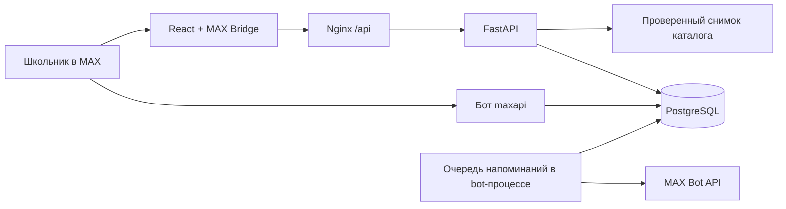

# Олимпиадный маршрут

Бот и мини-приложение MAX: школьник выбирает программы вуза, собирает олимпиадный трек, проверяет условия льгот и получает напоминания с действиями. Продуктовый кейс — [.agents/CASE.md](.agents/CASE.md).

## Что работает

- Адаптивный интерфейс: каталог, поиск и фильтры, карточки источников, профиль и выбор целей, личный маршрут, календарь, история напоминаний.
- Две программы московского кампуса ВШЭ и пять олимпиадных профилей. Проверенные связи с правилами приёма 2026 года отделены от неизвестных условий и будущих кампаний.
- Хранение профилей, треков, отметок, сессий и очереди сообщений в PostgreSQL. SQLite поддерживается для локального запуска и тестов.
- Вход через MAX: серверная проверка HMAC `initData`, срока действия и идентификатора; далее используется случайный отзываемый токен сессии. На сервере хранится его хеш.
- Бот: приветствие, открытие мини-приложения, `/stop`, обработка кнопок уведомлений. Изменения видны в приложении после возврата или следующего опроса API (15 секунд).
- Напоминания за семь дней и за сутки до известного срока, тихие часы, отмена устаревших напоминаний, перенос на час и защита от обычной повторной отправки одной задачи.
- Отдельные тестовые события регистрации и изменения правила. В браузерном демо показывается пример сообщения; для пользователя MAX оно ставится в настоящую очередь доставки.
- Удаление профиля вместе с треком, историей и сессиями.

## Быстрый запуск в Docker

Нужны Docker Engine / Docker Desktop и Docker Compose v2.

```bash
cp .env.example .env
docker compose up --build -d --wait
```

Откройте **http://localhost:8080**. PostgreSQL и API не публикуют порты наружу; Nginx обслуживает интерфейс и проксирует `/api`. Миграции выполняются перед стартом API. По умолчанию доступно браузерное демо, токен MAX для него не нужен.

Если порт занят:

```bash
FRONTEND_PORT=18088 docker compose up --build -d --wait
```

Проверка и остановка:

```bash
curl http://localhost:8080/api/v1/healthz/ready
docker compose logs --tail=100 api
docker compose down
```

`down` сохраняет базу в Docker volume. После повторного запуска профиль и отметки остаются. `down -v` удаляет базу; используйте только для намеренного сброса тестового стенда.

Первоначальная загрузка базовых образов и пакетов зависит от сети. В Dockerfile используются закреплённые digest образов, `uv.lock` и `pnpm-lock.yaml`.

## Подключение к MAX

1. Заполните `APP_BOT_TOKEN` и `APP_BOT_USERNAME` в корневом `.env`. Имя — ник выданного бота без `@`. Ник можно получить через официальный `GET /me`; рабочий токен не передавайте frontend и не коммитьте.
2. Разместите frontend по публичному HTTPS-адресу. TLS завершает внешний reverse proxy; локальный Nginx слушает HTTP. Один origin должен обслуживать и приложение, и `/api`.
3. Передайте HTTPS-ссылку организаторам для привязки мини-приложения к выданному боту, как описано в [FAQ](.agents/sources/Общий%20FAQ.pdf). Этот шаг вне кода и пока не выполнен.
4. Запустите бота и API с одним токеном и одной базой:

```bash
docker compose --profile max up --build -d --wait
```

5. Откройте бота в MAX, нажмите «Начать», перейдите в маршрут, сохраните цели и разрешите напоминания.

Бот использует long polling, поэтому публичный webhook не обязателен. Webhook-режим сохранён: нужны `APP_BOT_MODE=webhook`, HTTPS URL и secret; при его использовании отдельно настройте прокси к порту бота и соответствующие переменные Compose. Не запускайте одновременно несколько polling-процессов с одним токеном.

MAX Bridge подключён из официального CDN. Ссылки на источники открываются через Bridge, когда приложение запущено в MAX. Подпись проверяется по [официальному протоколу MAX](https://dev.max.ru/docs/webapps/validation); браузерные `initDataUnsafe` не используются как основание авторизации.

## Проверка основного сценария

1. Открыть приложение, нажать «Собрать маршрут». Вне MAX при включённом демо создаётся отдельный демонстрационный профиль.
2. Выбрать ПМИ и/или программную инженерию, класс, год поступления и интересующие предметы. Включить напоминания и сохранить профиль.
3. Открыть карточку ВсОШ: проверить результат, условия и ссылку на источник. У «Высшей пробы» явно видны непроверенные льготы и прошедший срок общей регистрации.
4. Добавить олимпиаду в маршрут. Открыть «Мой маршрут» → «Проверить напоминания» → «Тест регистрации».
5. В браузере появляется карточка «Пример в браузере». В MAX сообщение отправляет отдельный bot-процесс при ближайшем проходе очереди. Чтобы не ждать окончания тихих часов, для демонстрации установите одинаковые часы начала и окончания.
6. Нажать «Я зарегистрировался». Статус меняется в маршруте; напоминания о регистрации прекращаются. Это самоотчёт, а не интеграция с системой регистрации организатора.
7. Перезагрузить страницу: маршрут сохраняется. После 30-секундного ограничения можно создать «Тест изменения правила» и отметить прочтение.
8. Проверить удаление профиля. Старый токен перестаёт работать, очередь этого пользователя удаляется.

Тестовые события доступны только при `APP_DEMO_ENABLED=true`. Для реального пилота выключите этот флаг: демонстрационные входы и генерация событий станут недоступны.

## Данные и ограничения MVP

Каталог — небольшой редакционный снимок в [backend/src/app/route/catalog.py](backend/src/app/route/catalog.py), проверенный 30 сентября 2026 года. У записей есть первоисточник, дата проверки и примечание. В каталоге:

- ВсОШ: математика, программирование, искусственный интеллект; связи с программами ВШЭ по опубликованной таблице приёма 2026 года.
- «Высшая проба»: математика и информатика; общая регистрация 20 августа — 22 сентября 2026 года. Условия льгот для этих профилей пока имеют статус «нужна проверка».

Условия кампании 2026 года не переносятся автоматически на 2027–2028 годы. Неизвестные сроки не выдумываются, включение в каталог не означает право на БВИ. Региональные сроки ВсОШ необходимо уточнять у школьного координатора. В текущем снимке нет будущих точных сроков для автоматической реальной рассылки: механизм расписания проверяется на управляемых событиях и тестах.

Изменения правил пока демонстрируются модельным событием; автоматического сбора и проверки документов вузов нет. Для редакционного обновления измените каталог, проверьте источники и разверните новую версию. Перепланирование сроков выполняется при изменении профиля/трека; массовая фоновая сверка старых треков с новой редакцией пока не реализована.

Дедупликация обеспечивается уникальным ключом события и атомарным захватом задачи. После неопределённой ошибки отправки или аварии между отправкой и фиксацией результата задача помечается как не подтверждённая и автоматически не повторяется. Это предотвращает слепую повторную отправку, но не обещает гарантированную доставку или exactly-once на границе внешнего API. Ответ MAX также не подтверждает прочтение сообщения.

Перенос тестового сообщения в браузере создаёт задачу в очереди; её обработка после часа требует работающего bot-процесса, как и у остальных задач. Первая демонстрационная карточка создаётся сразу, без внешней отправки. SQLite предназначен для локальной проверки; конкурентная работа API и бота в развёртывании использует PostgreSQL с блокировками.

Профиль содержит только идентификатор MAX (либо случайный demo ID), класс, цели, настройки и самоотчёты. Удаление доступно в интерфейсе. Для реального запуска с несовершеннолетними нужны согласованный текст политики обработки данных, условия согласия и эксплуатационный процесс; интерфейсное согласие MVP не заменяет эту подготовку.

## Архитектура



- `backend/src/app/route/`: каталог, схемы, проверка авторизации, правила изменения трека и расписания.
- `backend/src/app/api/routes/v1/route.py`: API профиля, каталога, трека и сообщений.
- `backend/src/app/bot/`: транспорт MAX, обработчики и worker очереди.
- `backend/migrations/`: Alembic; история исходного шаблона сохранена.
- `frontend/src/`: интерфейс, клиент запросов, типы API, генерируемые из OpenAPI.

Секреты используются только backend. Сессия хранится в `sessionStorage` вкладки; в MAX новый вход восстановит профиль по проверенному идентификатору. В браузерном демо закрытие вкладки может потребовать создать новый профиль. Доступ к API защищён Bearer-токеном, CORS по умолчанию не включён; `initData` и токены не записываются в журналы запросов.

Внешние зависимости: API и CDN MAX; сайты первоисточников открываются пользователем; Google Fonts необязателен, при его недоступности используется системный шрифт. Для сборки нужны публичные реестры пакетов и контейнеров.

## Локальная разработка без Docker

Backend, Python 3.13+ и uv:

```bash
cd backend
cp ../.env.example .env
uv sync --locked --all-groups
uv run alembic upgrade head
uv run api
```

Frontend, Node.js 24+ и pnpm:

```bash
cd frontend
pnpm install --frozen-lockfile
pnpm dev
```

Открыть http://localhost:5173. Vite проксирует `/api` на `localhost:8000`. Для бота в отдельном терминале после настройки токена: `cd backend && uv run bot`.

## Проверки и API-контракт

```bash
cd backend
uv run ruff check .
uv run pyright
uv run pytest
uv run python tools/generate_openapi.py --check
```

```bash
cd frontend
pnpm lint
pnpm typecheck
pnpm build
pnpm exec playwright install chromium
pnpm test:e2e
```

Если уже установлен Chrome, вместо загрузки Chromium: `PLAYWRIGHT_CHANNEL=chrome pnpm test:e2e`. Браузерные тесты поднимают отдельный API на 18101 и frontend на 18180, используют SQLite `/tmp/olympiad-route-e2e.db`, проверяют настольный и мобильный сценарии. Снимки сохраняются в `frontend/test-results/`, эта директория исключена из Git.

OpenAPI 3.1: [backend/spec/openapi.yaml](backend/spec/openapi.yaml); интерактивная документация — `/api/docs`. После изменения API выполните `uv run python tools/generate_openapi.py` из backend и `pnpm generate:api` из frontend.

[DATA-API.yaml](DATA-API.yaml) содержит проверки полного сценария с отдельным demo-пользователем и удалением после проверки. Перед сдачей **замените `api.baseUrl` на действующий публичный HTTPS-адрес**. Значение `https://your-host.example/api` — явный placeholder, а не опубликованный сервис. Конфигурация проверена официальным [валидатором организаторов](https://gitverse.ru/stasnorman/example-data-api); для прогона нужен `APP_DEMO_ENABLED=true`. Для живого прогона сценария на локальном стенде:

```bash
cd backend
uv run python tools/check_scenario.py --base-url http://localhost:8080/api
```

Статический каталог находится в исходниках; отдельная загрузка тестовых пользователей не нужна, токен создаётся в первом шаге проверки.

Публичное HTTPS-развёртывание, привязка к выданному боту и PDF-презентация остаются шагами подготовки к сдаче хакатона. Реальная отправка через MAX требует рабочего токена и запущенного бота; автоматические тесты доставки используют контролируемую замену клиента MAX и не отправляют сообщения людям.
